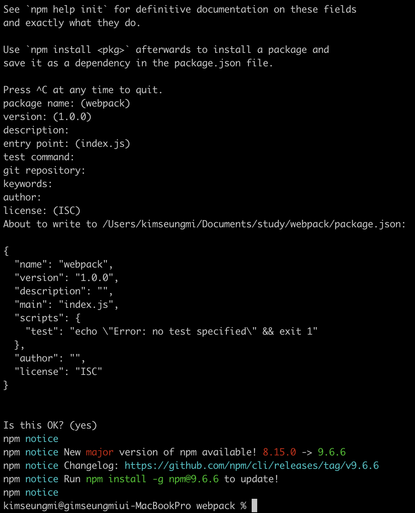

# 섹션 1. NPM
## 프로젝트 생성
- [링크](https://jeonghwan-kim.github.io/series/2019/12/09/frontend-dev-env-npm.html)

### 프론트엔드 개발에 Node.js가 필요한 이유
- 최신 스펙으로 개발할 수 있다.
- 빌드 자동화
- 개발 환경 커스터마이징
### Node.js 설치
- 짝수 버전: 안정적, 신뢰도 높음 (LTS)
- 홀수 버전: 최신 기능
- repl(read-eval-print loop) 실행
  - 터미널에 node 명령어 입력
  - 종료: .exit / ctrl + c 두번 입력
- 버전 확인
  - node -v
  - npm -v

|| 강의 기준 | 현재 | 설치 |
|---|---|---|---|
| node | LTS v12.14.1 | LTS v18.16.0| v16.17.1 |
| npm | v6.13.6 | v9.6.6 | v8.15.0 |

### 프로젝트 생성

### 패키지 설치
- CDN을 이용한 방법
- 직접 다운로드하는 방법
- NPM을 이용한 방법
#### 유의적 버전
- [유의적 버전](https://semver.org/lang/ko/)
- Major, Minor, Patch
#### 버전의 범위
- "~0", "^0" -> ^0.14.10"
- "~0.0", "^0.0" -> "^0.0.3"
- 현재는 npm i 하면 package.json의 버전을 변경 시킨다.

## Q. 
1. node.js 외의 개발환경 경험 공유해보기
2. 현재 프로젝트에서 ^을 사용하지 않는 경우를 찾고, 이유 생각해보기