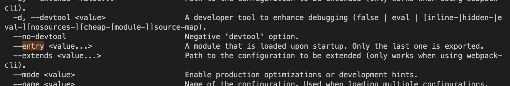
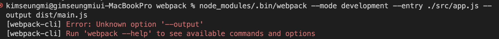

# 섹션 2. 웹팩(Webpack) - 기본편

## 1. 배경
- import/export 구문이 없던 상황: 전역 scope의 오염

### IIFE 방식의 모듈
- 즉시 실행 함수: 함수 스코프를 만들어 외부와 격리
```js
var math = math || {}

(function() {
    function sum(a, b) {
        return a + b
    }
    math.sum = sum 
})()
```

### 다양한 모듈 스펙
> CommonJS: exports / require()
  - [참고글: CommonJS와 ESM에 모두 대응하는 라이브러리 개발하기](https://toss.tech/article/commonjs-esm-exports-field)
> AMD: 비동기로 로딩되는 환경에서 모듈을 사용하는 것이 목표
> UMD: AMD기반으로 CommonJS 방식까지 지원하는 통합형태
> ES2015 표준 모듈 시스템
  - math.js
    ```js
    export function sum(a, b) {
        return a + b
    }
    ```
  - app.js
  ```js
    import * as math from "./math.js"
    math.sum(1, 2)
  ```
### 브라우져의 모듈 지원
```js
<script type="module" src="app.js"></script>
```

## 2. 엔트리/아웃풋
- 웹팩: 하나의 시작점(entry point)으로부터 의존적이 모듈을 전부 찾아내서 하나의 결과물을 만들어 낸다.
- webpack: 번들 작업 패키지
- webpack-cli: 웹팩 터미널 도구
- node_modules/.bin --help 옵션
  
- output 옵션 -> output-path

- webpack.config.js
```js
const path = require("path")

module.exports = {
  mode: "development",
  entry: {
    main: "./src/app.js",
  },
  output: {
    filename: "[name].js",
    path: path.resolve("./dist"),
  },
}
```
- path: path.resolve("./dist") -> path 문제 "__dirname"은 build 됨

## Q.
1. node.js의 ESM 지원 히스토리?
2. path.resolve, path.join 차이 (path 디버깅)