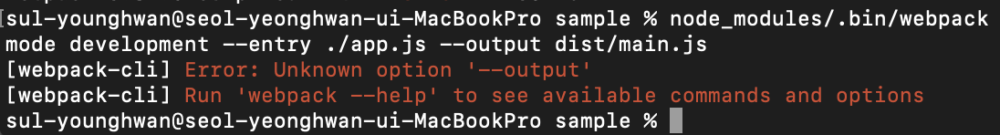

# Webpack (기본)

## html에서 script로 하지 않는 이유

- 전역변수가 오염된다
  -> 즉시실행함수(IIFE))를 이용하여 독립적인 스코프를 사용한다.

## 다양한 모듈 스펙

- CommanJS

  - 자바스크립트를 사용하는 모든 환경에서 모듈을 하는 것이 목표
  - exports 키워드로 모듈을 만들고 require()로 불러들인다.
  - Nodejs(서버사이드 플랫폼)에서 대체로 사용

- AMD, UMD
  - 브라우저(외부에서 js를 사용할때) 비동기로 로딩되는 환경에서 모듈을 사용하는것이 목표
  - ES2015에서 표준모듈시스템을 내놓았다.

math.js

```js
export function sum(a, b) {
  return a + b;
}
```

app.js

```js
// import * as math from './math.js';
import { sum } from "./math.js";
math.sum(1, 2); //3
```

# Entry output (실습)

- webpack
  여러개의 자바스크립트 파일을 하나로 합쳐주는 역할
  합쳐진 파일을 bundle이라고한다.(ㅈ듀ㅔ)

### 오류



- `--output`에서 `-o, --output-path`로 옵션이 변경됨
