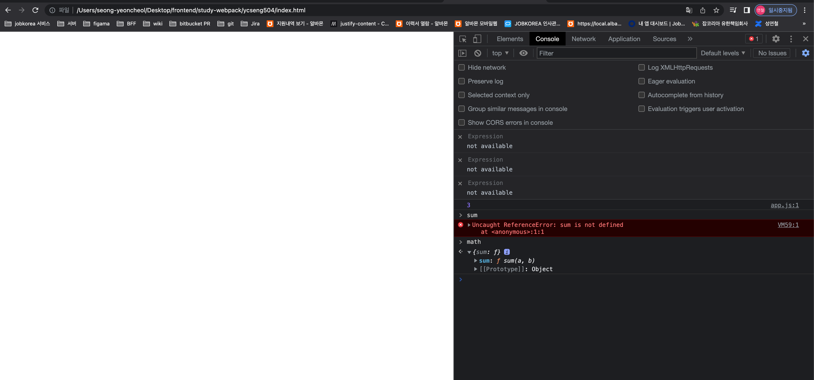

# 웹팩(webpack) - 기본편

## 1.배경

<br/>

#### math.js

```js
function sum(a, b) {
  return a + b;
}
```

#### app.js

```js
sum(1, 2); // 3
```

- 위의 코드는 하나의 HTML 파일안에서 로딩해야만 실행됨
- 'sum'이 전역 공간에 노출됨
- 다른 파일에서 'sum'을 사용하면 충돌(런타임) 발생

<br/>

### 1.1 IIFE 방식의 모듈

- 위의 문제를 예방하기 위해서 스코프를 사용
- 스코프 안에서는 자신만의 이름 공간이 존재하므로 충돌을 막을 수 있음

#### math.js

```js
var math = math || {}; // math 네임스페이스
(function () {
  function sumb(a, b) {
    return a + b;
  }
  math.sum = sum; // 네임스페이스에 추가
})();
```

- 다른 파일에서 접근 불가



<br/>

### 1.2 다양한 모듈 스펙

</br>

### **자바스크립트 모듈을 구현하는 대표적인 명세가 AMD, CommonJS**

- CommonJS는 자바스크립트를 사용하는 모든 환경에서 모듈을 하는 것이 목표
- AMD(Asynchronous Module Definition) 비동기로 로딩되는 환경에서 모듈을 사용하는 것이 목표
- UMD(Universal Module Definition) AMD 기반으로 CommonJS 방식까지 지원 통합

#### math.js

```js
exports function sum(a, b) { return a + b; }
```

#### app.js

```js
const sum = require("./math.js");
sum(1, 2); // 3
```

</br>

### **ES2015에서 표준 모듈 시스템이 나타남**

- 바벨과 웹팩을 이용해 모듈 시스템을 사용함
- export 구문으로 모듈로 만들고 import로 가져옴

#### math.js

```js
export function sum(a, b) {
  return a + b;
}
```

#### app.js

```js
import * as math from "./math.js";
math.sum(1, 2); // 3
```

### 1.3 브라우져의 모듈 지원

- 모든 브라우져에서 모듈 시스템을 지원하지 않음 (ex.인터넷 익스플로러)
- 크롬 브라우저는 버전 61부터 모듈시스템을 지원함

#### index.html

```html
<script type="module" src="app.js"></script>
```

script 태그로 실행할 떄 type='module'을 사용

</br>

## 2.엔트리/아웃풋

- 웹팩은 여러개 파일을 하나의 파일로 합쳐주는(bundler) 이다.
- 하나의 시작점(entry point)으로부터 의존적인 모듈을 찾아서 결과물로 만들어 준다.

### webpack-cli 명령어

- cd ycseng/src
- node_modules/.bin/webpack --mode development --entry ./app.js --output dist/main.js

### webpack-config build 명령어

- cd ycseng/src
- npm run build
